

# My Portfolio

  
## Hi, I'm Rafael Kenneth F. Saluba

  

  

BSIT Student • EARIST Manila • OJT/Intern Applicant
  
## Education

**Bachelor of Science in Information Technology (BSIT)**  
**Eulogio "Amang" Rodriguez Institute of Science and Technology (EARIST)**

---

## About Me

I am a motivated BSIT student with hands-on experience in web and mobile application development, currently expanding my knowledge in cybersecurity. I enjoy building systems and continuously improving my programming skills through personal projects, teamwork, and collaborative learning. I am eager to apply my technical skills to real-world solutions while continuing to grow as an IT professional.

---

## Projects

Here you'll find my academic and personal projects related to:

### Web-Based Systems
- **EARIST OJT Management System** - AI-powered internship management platform with QR code evaluation, 2FA authentication, and multi-role dashboards (Admin, Coordinator, Supervisor, Student)
- Full-stack development using Django and React
- Features include AI-powered internship matching, automated grading, and real-time analytics

### Mobile Applications
- Mobile-responsive web applications
- Cross-platform development
- User-friendly interfaces

### Design and Editing
- UI/UX design for web applications
- Graphic design and visual content
- Modern and responsive layouts

---

# My Certificates

### Cisco Networking Academy
< 

### Webinar Certificates

# Tools that i used

    
   

   <h3 align="center">My Projects</h3>
  
 Capstone:AI Powered Internship System for Eulogio “Amang” Rodriguez Institute of Science and Technology - Manila

  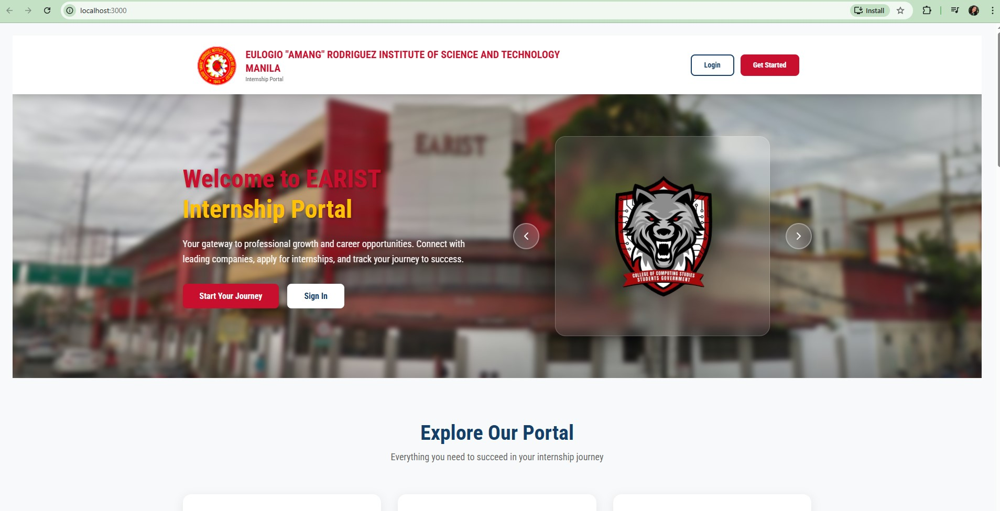
  
  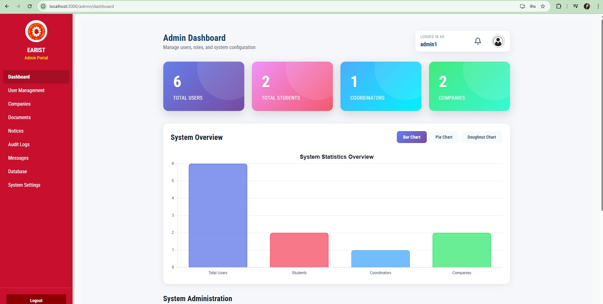
  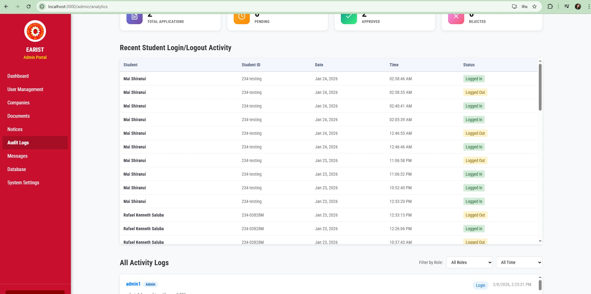
  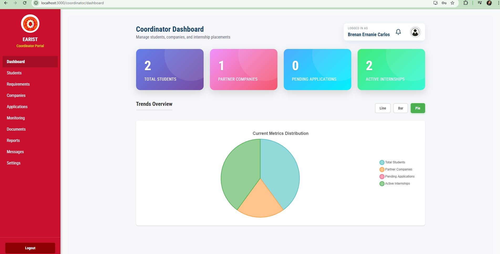
  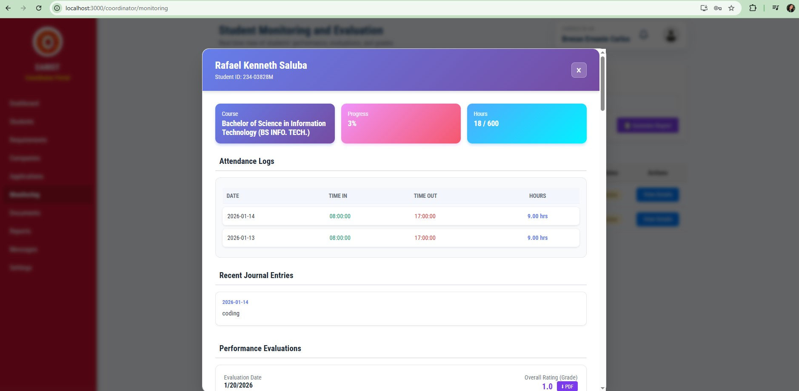
  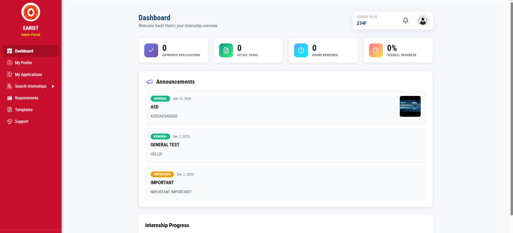
  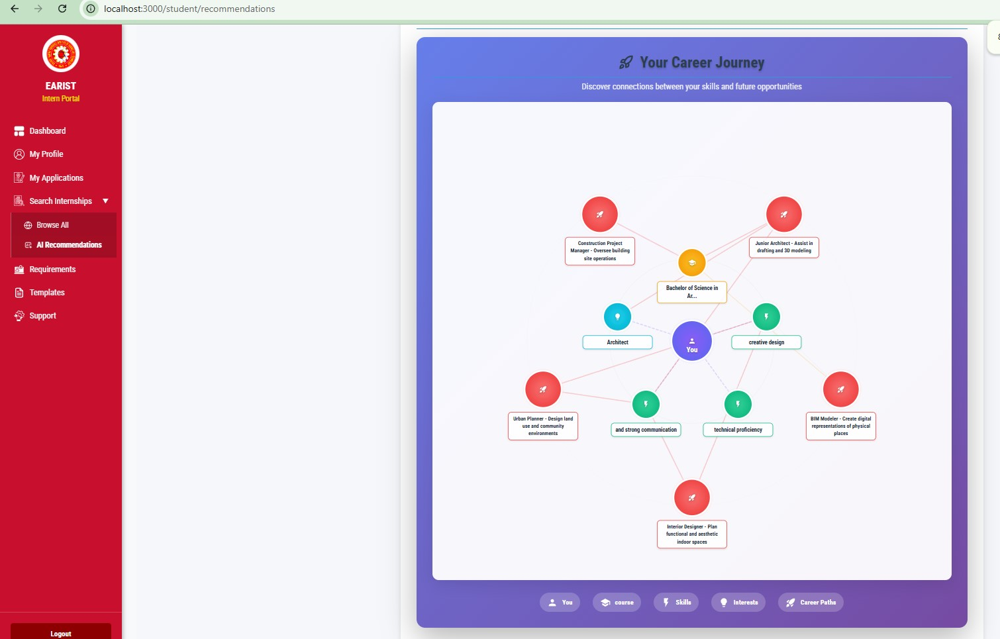

  

    This system is designed to help OJT/Intern students match their course and skills based on the job that they need.
  

    
   

   <h3 align="center">My Projects</h3>
   <table align="center">
      <tr>
     <td align="center">
Hydrate Your Farm: Water Irrigation System for Farms
   

   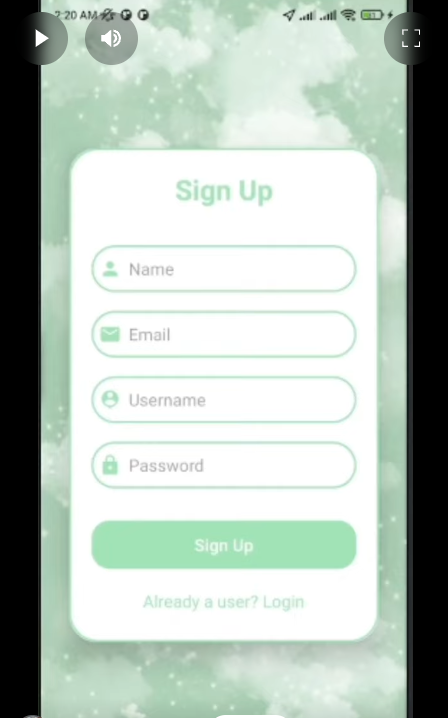
  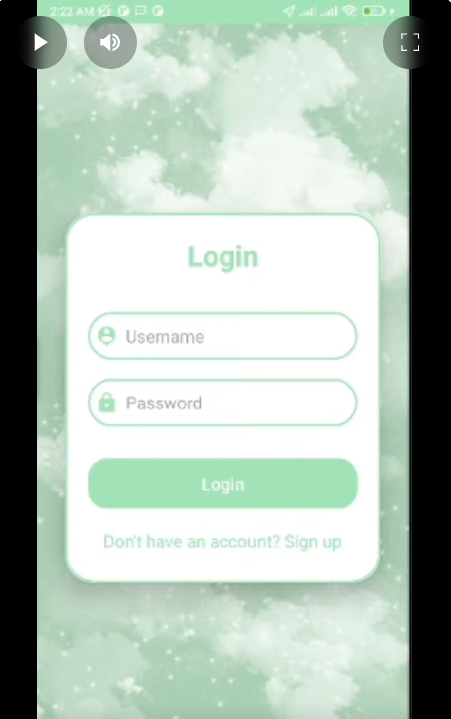
  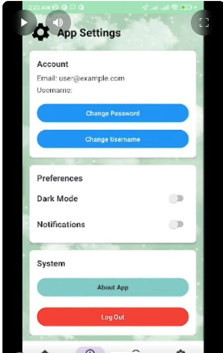
  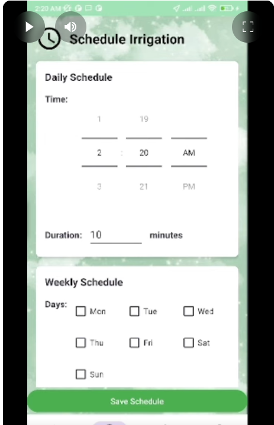
  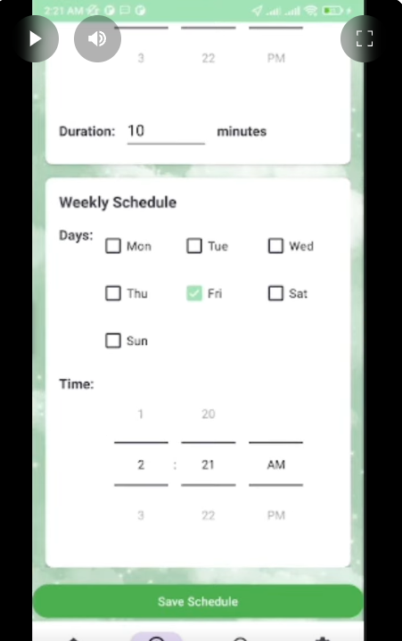
  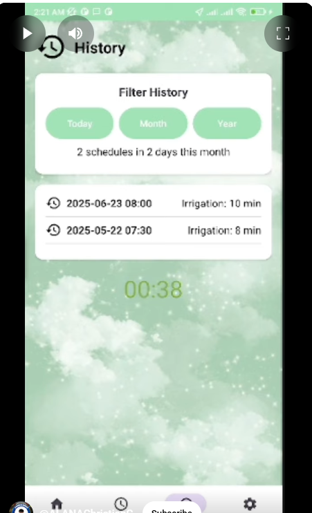
  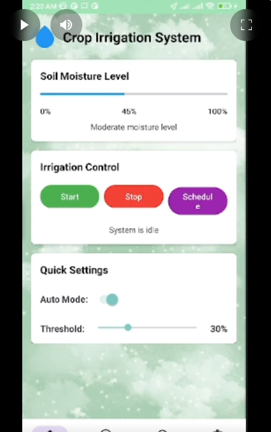
  </td>
   </tr>  
</table>

   # 💻 My favorite tools and technologies

<table align="center">
  <tr>
    <td align="center" width="96">
        
       React
    </td>
    <td align="center" width="96">
      
       Python
    </td>
    <td align="center" width="96">
        
       JavaScript
    </td>
    <td align="center" width="96">
        
       C++
    </td>
    <td align="center" width="96">
        
       Webpack
    </td>
    <td align="center" width="96">
        
       MySQL
    </td>
    <td align="center" width="96">
        
       TypeScript
    </td>
    <td align="center" width="96">
        
       AWS
    </td>
    <td align="center" width="96">
        
       C#
    </td>
  </tr>
  <tr>
  <td align="center" width="96">
        
       Django
    <td align="center" width="96">
        
       Github
    </td>
    <td align="center" width="96"> 
        
       Git
    </td>
    <td align="center"  width="96">
        
       Laravel
    </td>
    <td align="center"  width="96">
        
       HTML5
    </td>
    <td align="center" width="96">
        
       CSS
    </td>
    <td align="center"  width="96">
        
       Bootstrap
    </td>
    <td align="center" width="96">
        
       Tailwind
    </td>
    <td align="center" width="96">
        
       jQuery
    </td>
  </tr>
 <tr>
      <td align="center" width="96">
        
       MongoDB
    </td>
        <td align="center" width="96">
        
       Nodejs
      </td>
      </td>
    <td align="center" width="96">
        
       PHP
    </td>
            <td align="center" width="96">
        
       VsCode
    </td>
              <td align="center" width="96">
        
       WordPress
    </td>
              <td align="center" width="96">
        
       Vue
    </td>
              <td align="center" width="96">
        
       Sass
    </td>
              <td align="center" width="96">
        
       GraphQL
    </td>
    <td align="center" width="96">
        
       PostgreSQL
    </td>
 </tr>
</table>
  

