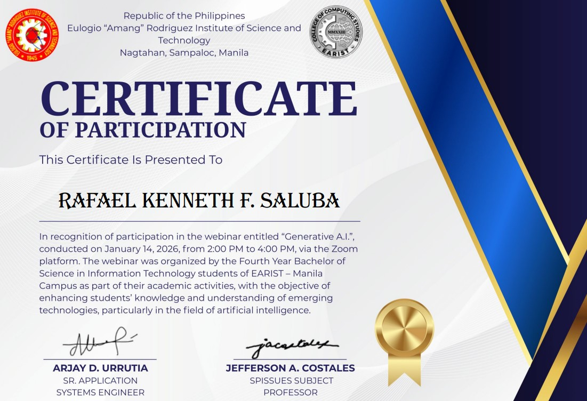
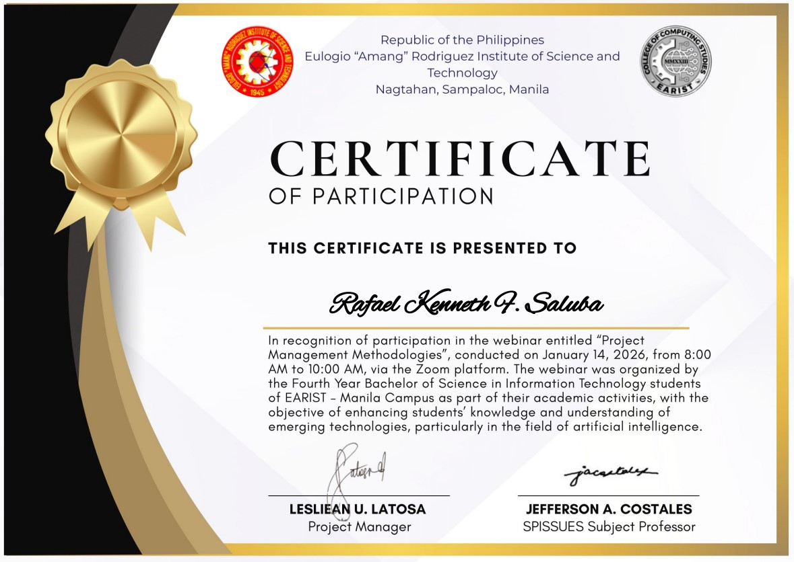
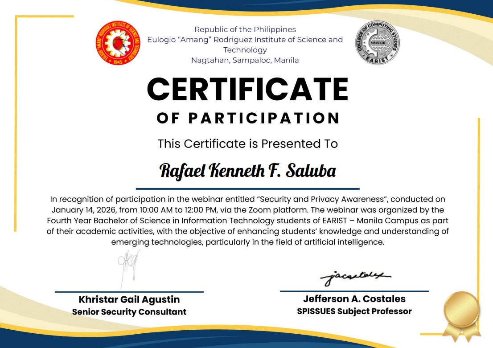
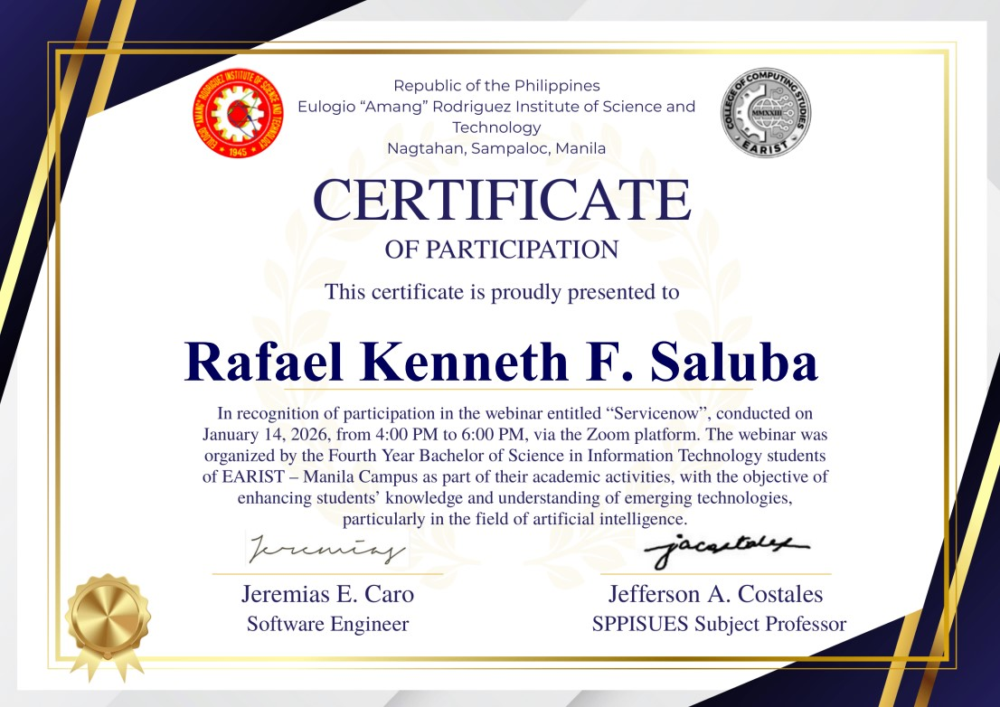

# My Portfolio

## Hi, I'm Rafael Kenneth F. Saluba

BSIT Student • EARIST Manila • OJT Applicant
## Education

**Bachelor of Science in Information Technology (BSIT)**  
**Eulogio "Amang" Rodriguez Institute of Science and Technology (EARIST)**

---

## About Me

I am a motivated BSIT student with hands-on experience in web and mobile application development. I enjoy building systems that solve real-world problems and continuously improving my programming skills through projects and collaboration.

---

## Projects

Here you'll find my academic and personal projects related to:

### Web-Based Systems
- **EARIST OJT Management System** - AI-powered internship management platform with QR code evaluation, 2FA authentication, and multi-role dashboards (Admin, Coordinator, Supervisor, Student)
- Full-stack development using Django and React
- Features include AI-powered internship matching, automated grading, and real-time analytics

### Mobile Applications
- Mobile-responsive web applications
- Cross-platform development
- User-friendly interfaces

### Design and Editing
- UI/UX design for web applications
- Graphic design and visual content
- Modern and responsive layouts

---

# My Certificates

### Cisco Networking Academy
< 

### Webinar Certificates

# Tools that i used

  

